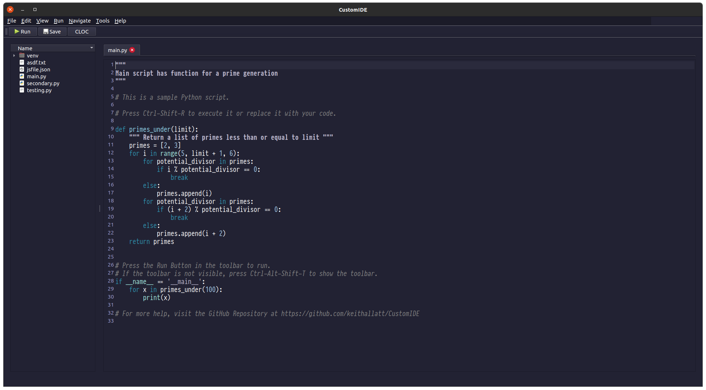

# CustomIDE

Custom IDE built in Python 3 and the PyQt5 module. Designed to work on Ubuntu 20.04 LTS with GNOME, 
but could potentially be modified to work on other operating systems / desktop environments.

---

Currently the IDE only has a dark mode (a programmer favourite), but also currently comes with 2 themes.

As this project is still in it's early stages, a lot of the themes, color schemes, and general layout 
are likely to change.

---

Current Feature List
 - The ability to open, edit, and save files.
 - Basic linting (gets every convention issue / warning / error),
   - Unfortunately, this linting process catches everything, so there are some things I'd like to set up that the
     linter will ignore.
   - Hovering mouse over the line numbers where linting picked something up will show the pylint message.
 - Python syntax highlighting.

---

